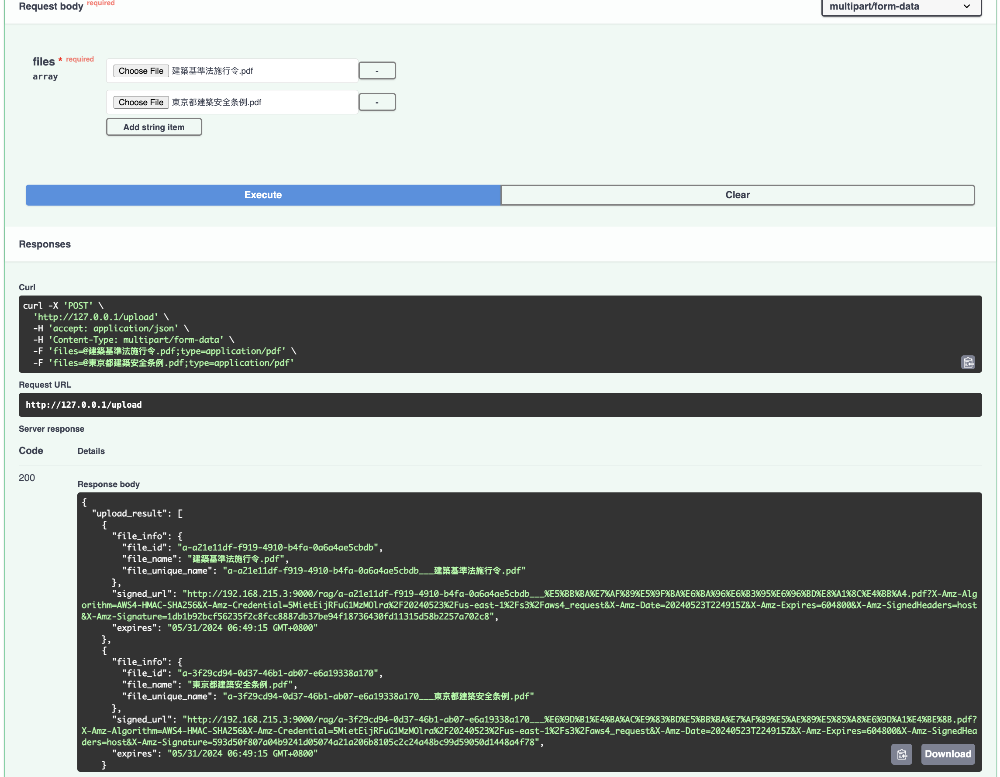
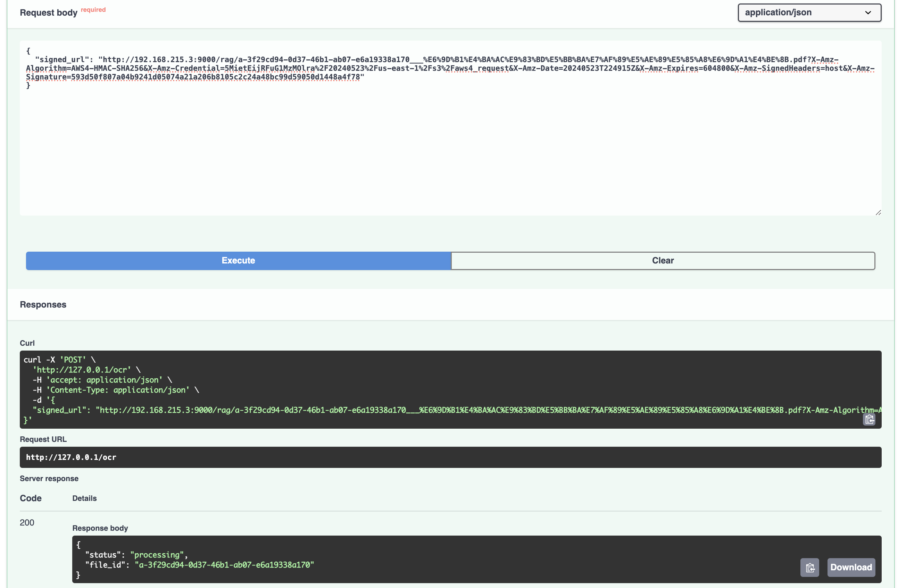
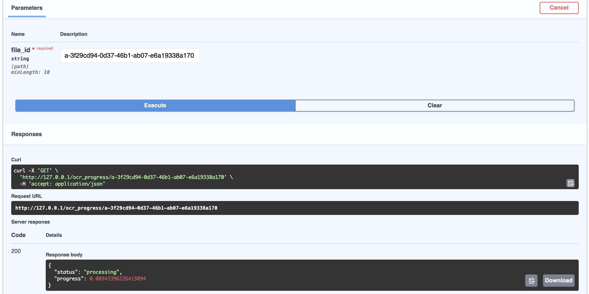
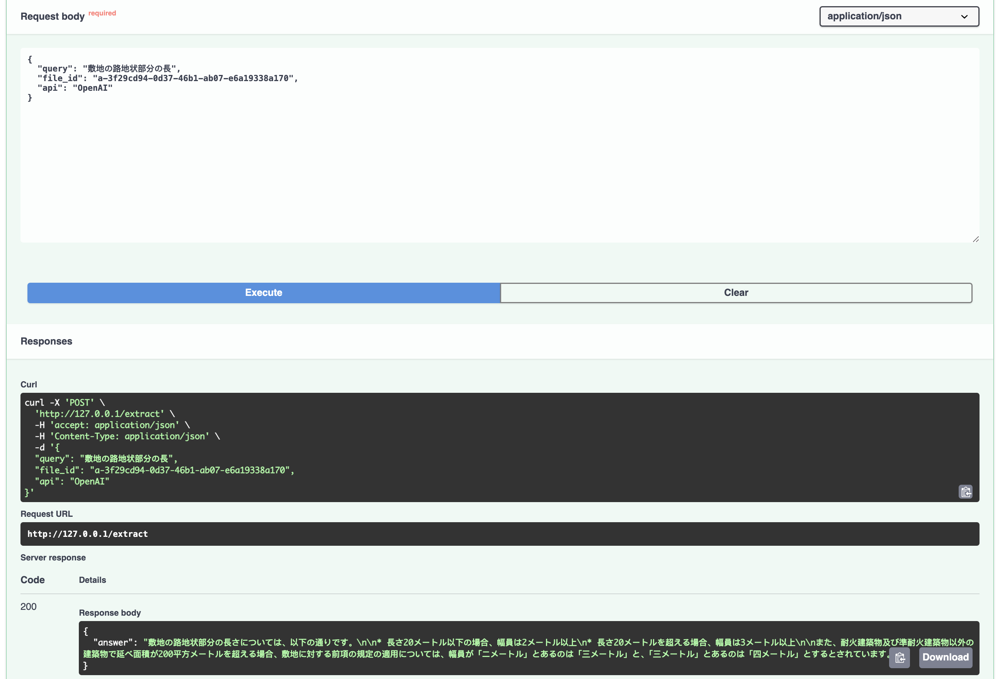

# RAG

## Project Summary: Intelligent Document Analysis with Retrieval-Augmented Generation (RAG) and Vector Search

This open-source project leverages Optical Character Recognition (OCR) to convert files in various formats (PDF, TIFF, PNG, JPEG) into text. It integrates Retrieval-Augmented Generation (RAG) for extracting relevant attributes from the text. The core functionality involves taking a query text as input, performing a vector search to identify relevant parts of the file, and using Large Language Model (LLM) providers such as OpenAI, KIMI, and Tencent Hunyuan to generate answers from the search results.

## Feature List

| Feature                  | Description                                                                                      |
|--------------------------|--------------------------------------------------------------------------------------------------|
| File Upload              | Facilitates the upload of files in supported formats for processing.                             |
| Multi-format OCR         | Supports OCR for PDF, TIFF, PNG, and JPEG files, converting them into text.                      |
| Vector Search            | Performs vector search to identify relevant parts of the text based on embeddings.               |
| LLM Integration          | Integrates with LLM providers like OpenAI, KIMI, and Tencent Hunyuan for generating responses.   |
| Embedding-based Retrieval| Uses vector embeddings for accurate and efficient information retrieval.                         |

## Getting Started with RAG

**install with Docker**

1. Clone the repos
2. Set neccessary environment variables

    Make sure to set your required environment variables in the `.env` file. You can read more about how to set them up in the [API Keys Section](#api-keys)

3. Deploy using Docker

    With Docker installed and the rag repository cloned, navigate to the directory containing the Dockerfile in your terminal or command prompt. Run the following command to start the rag application in detached mode, which allows it to run in the background:

```bash
# clone rag repo
git clone https://github.com/likid1412/rag

# navigate to rag
cd rag

# build, will download the necessary Docker images
docker build -t rag .

# run and start rag
docker run --env-file .env -dt --name rag -p 80:80 rag

# check rag logs, once success, you should see `Application startup complete.`
docker container logs rag
```

Remember, Docker must be installed on your system to use this method. For installation instructions and more details about Docker, visit the official Docker documentation.

You can read [FastAPI in Containers](https://fastapi.tiangolo.com/deployment/docker/) for a quick start.

4. **Access rag**

- You can access your local rag [Interactive API docs](http://127.0.0.1:80/docs)
- You can access your local rag [Alternative API docs](http://127.0.0.1:80/redoc)

5. **logs**

    We will send logged messages to `app.log` file and the `stdout` using [loguru](https://github.com/Delgan/loguru)

- For `app.log` file, it will located at `/rag/app.log`
- For `stadout`, you can check it use command such as `docker container logs -f rag`, use `docker container logs --help` to read more

## API Keys

Before starting rag you'll need to configure access to various components depending on your chosen technologies, such as OpenAI, hunyuan, and Kimi via an `.env` file. Create this `.env` in the same directory you want to start rag in. Check the [.env.example](./.env.example) as example.

>Make sure to only set environment variables you intend to use, environment variables with missing or incorrect values may lead to errors.

Below is a comprehensive list of the API keys and variables you may require:

| Environment Variable | Value | Description |
|---|---|---|
| MINIO_ENDPOINT | the endpoint to your minio storage | See [Minio as local storage](docs/minio.md) |
| MINIO_ACCESS_KEY | Minio access key | See [Minio as local storage](docs/minio.md) |
| MINIO_SECRET_KEY | Minio secret key | See [Minio as local storage](docs/minio.md) |
|---|---|---|
| TENCENT_VECTOR_URL | URL for Tencent Vector Database | Access to [Tencent Vector Database](https://console.cloud.tencent.com/vdb) |
| TENCENT_VECTOR_USER | Username for Tencent Vector Database | Access to [Tencent Vector Database](https://console.cloud.tencent.com/vdb) |
| TENCENT_VECTOR_KEY | API Key for Tencent Vector Database | Access to [Tencent Vector Database](https://console.cloud.tencent.com/vdb) |
|---|---|---|
| TENCENTCLOUD_SECRET_ID | Tencent Cloud Secret ID for Tencent hunyuan LLM | Access to [Tencent API](https://console.cloud.tencent.com/cam/capi) for Tencent hunyuan LLM |
| TENCENTCLOUD_SECRET_KEY | Tencent Cloud Secret Key for Tencent hunyuan LLM | Access to [Tencent API](https://console.cloud.tencent.com/cam/capi) for Tencent hunyuan LLM |
| TENCENT_MODEL | Tencent HunYuan Model name | [Tencent hunyuan model](https://cloud.tencent.com/document/api/1729/105701) |
|---|---|---|
| API_KEY | OpenAI SDK API Key | Accee OpenAI or compatible LLM Provider API Key such as [Kimi](https://platform.moonshot.cn/console/api-keys) |
| BASE_URL | OpenAI SDK Base URL | Accee OpenAI or compatible LLM Provider API Key such as [Kimi](https://platform.moonshot.cn/console/api-keys) |
| MODEL | OpenAI SDK Model name | Model of OpenAI or compatible LLM Provider |


## Storage

Use minio as local storage, see [Minio as local storage](docs/minio.md) for more detail

## Embedding

### OpenAI embedding

You can get it from [OpenAI](https://openai.com/)

### Tencent hunyuan embedding

Check [hunyuan-embedding-API](https://cloud.tencent.com/document/api/1729/102832) for more detail.

You can find instructions for obtaining a key [here](https://console.cloud.tencent.com/hunyuan/start)

## Vector Database

You can get it from [Tencent Vector Database](https://console.cloud.tencent.com/vdb)

## LLM providers

### OpenAI

You can get it from [OpenAI](https://openai.com/)

### Kimi (Moonshot)

Check [Moonshot](https://platform.moonshot.cn/docs/api/chat) for more detail.

You can find instructions for obtaining a key [here](https://platform.moonshot.cn/console/api-keys)

### Tencent hunyuan

Check [hunyuan](https://cloud.tencent.com/document/api/1729/105701) for more detail.

You can find instructions for obtaining a key [here](https://console.cloud.tencent.com/hunyuan/start)

## Endpoint usage examples

Once you have access to rag, you can interact with API using the [Interactive API docs](http://127.0.0.1:80/docs), below is the endpoint usage examples.

### File Upload Endpoint

**Functionality**

- Accepts one or more file uploads (limited to pdf, tiff, png,jpeg formats).
- Saves the processed file to storage (e.g, MinIO) solution, returning one or more unique file identifiers or signed URLs for the upload.

**Usage example**

- Read the alternative automatic documentation for more [Upload - ReDoc](http://127.0.0.1/redoc#operation/upload_upload_post)
- Try it out: [File Upload Endpoint: /upload](http://127.0.0.1/docs#/default/upload_upload_post)
- Click the `Add string item`, and choose file to upload, and will return uploaded file info with the original file name from uploaded file, unique file id, signed URL and unique file name which you can search in minio



### OCR Endpoint

**Functionality**

- Running an OCR service on the file downloaded from the `signed_url`
- Process OCR results with embedding models (e.g, OpenAI, Tencent hunyuan)
- Upload the embeddings to a vector database (e.g, Pinecone, Tencent Vector Database) for future searches.

**Usage example**

- Read the alternative automatic documentation for more [Ocr - ReDoc](http://127.0.0.1/redoc#operation/ocr_ocr_post)
- Try it out: [OCR Endpoint: /ocr](http://127.0.0.1/docs#/default/ocr_ocr_post)
- Fill the `signed_url` value with the url got from upload endppoint, this endpoint return immediately, because it will take some times, doing several tasks in the background mention above.
- The return result look like below, you can check progress using [Get OCR Progress Endpoint](#get-ocr-progress-endpoint) :



### Get OCR Progress Endpoint

**Functionality**

- Get ocr progress

**Usage example**

- Read the alternative automatic documentation for more [Get Ocr Progress - ReDoc](http://127.0.0.1/redoc#operation/get_ocr_progress_ocr_progress__file_id__get)
- Try it out: [Get OCR Progress Endpoint: /ocr_progress/{file_id}](http://127.0.0.1/docs#/default/get_ocr_progress_ocr_progress__file_id__get)
- Fill the `file_id` which pass to ocr endpoint to get the current progress
- If still processing, return `{"status": "processing", "progress": 0.xxx}`

    

- If completed, return `{"status": "completed"}`

    

### Attribute Extraction Endpoint

**Functionality**

- Takes a query text and file_id as input, performs a vector search and returns relevanted text based on the embeddings.
- Chat with LLM provider (e.g, OpenAI, Tencent hunyuan) to generate the answer from the search result.

**Usage example**

- Read the alternative automatic documentation for more [Extract - ReDoc](http://127.0.0.1/redoc#operation/extract_extract_post)
- Try it out: [Attribute Extraction Endpoint: /extract](http://127.0.0.1/docs#/default/extract_extract_post)
- Takes a query text and `file_id` as input, choose LLM provider api (`OpenAI` or `hunyuan`), return the answer from query using LLM and relevant texts search from vector database which related to the file_id
    - For `OpenAI` api, can use OpenAI model or compatible LLM Provider model such as [Kimi](https://platform.moonshot.cn/console/api-keys)
    - For `hunyuan` api, can use Tencent hunyuan model




## TODO

- Upload large file using stream upload
- Add requestId for trace
- Add Monitoring and Observability
    - [What is API Monitoring? Use Cases, Tools & Best Practices | Postman](https://www.postman.com/api-platform/api-monitoring/)
    - [API Observability: API Telemetry Data, Pillars & Use Cases | Postman](https://www.postman.com/api-platform/api-observability/)
- TODO/FIXME in code

## One More Thing

### About Chunking Strategies

Seems the oce result has divided the content based on its structure and hierarchy, which is the paragraphs, resulting in more semantically coherent chunks, we can simple use Fixed-size chunking base on the paragraphs.

read more: [Chunking Strategies for LLM Applications | Pinecone](https://www.pinecone.io/learn/chunking-strategies/)